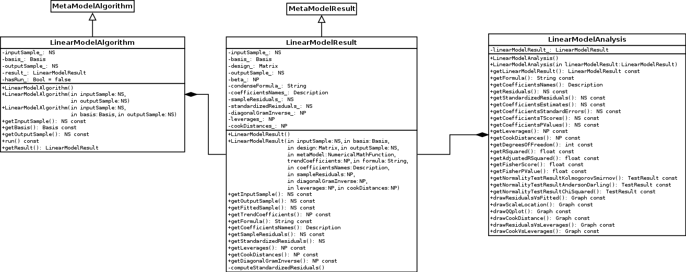
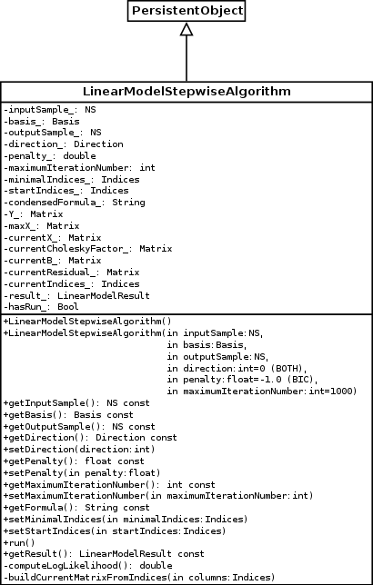

Linear regression models
========================

Let us consider the general linear regression model:

.. math::

    \boxed{Y \,=\, X \,\beta\, +\, \epsilon}

Where :math:`X` is the design matrix of explanatory variables of size :math:`(n \times p)`,
:math:`Y` is the vector of response values of size :math:`(n)`,
:math:`\beta` is a vector of unknown parameters to be estimated of size :math:`(p)`,
and :math:`\epsilon` is the error vector of size :math:`(n)`; :math:`\epsilon` is assumed to follow the standard Normal distribution.

We define :math:`G_X` the Gram matrix of :math:`X` of size :math:`(p\times p)`, :math:`A_X` its inverse,
and :math:`H_X` the projection matrix of size :math:`(n\times n)` by:

.. math::

    G_X \hat{=}X^T X  \quad,\quad  A_X \hat{=}(X^T X)^{-1}  \quad,\quad
    H_X \hat{=} X_{}\,\big(X^T_{} \,X_{}\big)^{-1} \,X^T_{}  =  X_{}\,A_X \,X^T_{}

We define the *Log likelihood* function by:

.. math::

    \log L(\beta,\sigma\mid Y)= -\frac{n}{2}\big(\log(2\pi)+ \log(\sigma^2)\big)- \frac{1}{2\sigma^2}\big(Y-X\beta\big)^T\,\big(Y-X\beta\big)

The solution which maximizes the *Log likelihood* function is:

.. math::
    :label: beta_sigma_opt

    \hat{\beta} \,=\, \big(X^T_{} \,X_{}\big)^{-1} \,X^T \, Y
    \quad,\quad
    \hat{\sigma}^2 = \frac{1}{n}\big(Y-X \,\hat{\beta}\big)^T\,\big(Y-X \,\hat{\beta}\big)

Using equation :eq:`beta_sigma_opt`, the maximum *Log likelihood* turns into:

.. math::
    :label: maxLogLikelihood

    \log L(\hat{\beta},\hat{\sigma}\mid Y)=-\frac{n}{2}\big(\log(2\pi)+ \log(\hat{\sigma}^2)+1\big)
    \quad \text{where} \quad
    \hat{\sigma}^2 = \frac{1}{n}\big(Y-H_X\,Y\big)^T\,\big(Y-H_X\,Y \big)=\frac{1}{n}\|\,Y-H_X\,Y\,\|^2_2

The residuals are defined by

.. math::

    \hat{\epsilon} = Y - H_X Y

Architecture considerations
===========================

Dependencies
------------

Several dependencies are needed in order to build the module:

 - OpenTURNS
 - Sphinx-doc (optional for this doc)

Compilation
-----------

.. code-block:: bash

    cd otlm
    mkdir -p build && cd build
    cmake \
      -DCMAKE_INSTALL_PREFIX=$PWD/install \
      -DOpenTURNS_DIR=$PWD/../../openturns/build/install/lib/cmake/openturns \
      ..

Source code structure
---------------------

This section makes up the general specification design for the linear model stepwise regression analysis
in OpenTURNS.

LinearModel
~~~~~~~~~~~

The :class:`~openturns.LinearModel` class is outdated and does not follow
current best practices about metamodel classes.
We will introduce :class:`~otlm.LinearModelAlgorithm`,
:class:`~otlm.LinearModelAnalysis` and :class:`~otlm.LinearModelResult`
classes.
All current uses of :class:`~openturns.LinearModel` have to be modified; it is
used in classes :class:`~openturns.VisualTest`, :class:`~openturns.CorrelationAnalysis`
and :class:`~openturns.LinearModelTest`.
Class :class:`~openturns.LinearModelFactory` has to be deprecated.

   LinearModelAlgorithm and LinearModelResult classes

ANOVA table
~~~~~~~~~~~

It is requested to give access to the following data:

* Linear model formula, in a textual form
* Residuals
* For each factor,

  - its coefficient
  - its standard error
  - p-value for Student test

* Number of degrees of freedom
* Coefficients :math:`R^2` and adjusted :math:`R^2`
* p-value of the Fisher test
* normality tests on residuals (Kolmogorov-Smirnov, Anderson-Darling and :math:`\chi^2`)

Note: Student test uses standardized residuals

.. math:: \frac{\hat{\beta}_i}{\sqrt{\frac{n}{n-p-1}\left[(X^T X)^{-1}\right]_{i,i}}}

Graphical diagnostics
~~~~~~~~~~~~~~~~~~~~~

Several plots are provided by :class:`~otlm.LinearModelAnalysis` class, see diagram class.

* :func:`~otlm.LinearModelAnalysis.drawResidualsVsFitted` plots standardized residuals
  :math:`\tilde{\epsilon}` vs. fitted values, with

  .. math:: \tilde{\epsilon}_i = \frac{\hat{\epsilon}_i}{\sqrt{\frac{n}{n-p-1}\hat{\sigma}^2 (1-H_{i,i})}}

* :func:`~otlm.LinearModelAnalysis.drawQQplot` plots :math:`\sqrt{|\tilde{\epsilon}_i|}`
  vs. theoretical quantiles.
* :func:`~otlm.LinearModelAnalysis.drawScaleLocation` plots :math:`\sqrt{\tilde{\epsilon}_i}`
  vs. fitted values.
* :func:`~otlm.LinearModelAnalysis.drawCookDistance` plots an histogram of Cook's distance

  .. math:: D_i = \frac{\tilde{\epsilon}_i^2}{p} \left(\frac{H_{i,i}}{1-H_{i,i}}\right)

* :func:`~otlm.LinearModelAnalysis.drawResidualsVsLeverages` plots standardized
  residuals :math:`\tilde{\epsilon}` vs leverages

  .. math:: h_i = H_{i,i}

  Moreover, this plot also contains contour plot of function

  .. math:: D(x,y) = \frac{y^2}{p}\left(\frac{x}{1-x}\right)

  for levels 0.5 and 1.
* :func:`~otlm.LinearModelAnalysis.drawCookVsLeverages` plots Cook's distance
  :math:`\tilde{\epsilon}` vs :math:`\frac{h_i}{1-h_i}`.

  .. math:: h_i = H_{i,i}

  Moreover, this plot also contains isolines of function

  .. math:: \frac{py}{x}

Stepwise regression methods
~~~~~~~~~~~~~~~~~~~~~~~~~~~

The stepwise regression method consists in choosing the best predictive variables by an automatic procedure
according to a selected model criterion (Akaike information criterion (AIC), Bayesian information criterion (BIC)).
We define the sets of variables indices :math:`S_{min}\,\subseteq\, S_0\,\subseteq\, S_{max}`.
Let us consider :math:`S` a set of variables indices and :math:`\# S` the cardinal of :math:`S`, the (AIC) and (BIC) criteria are:

* (AIC): :math:`-2\,\log L(\hat{\beta},\hat{\sigma}\mid Y) + 2 \times \# S`
* (BIC): :math:`-2\,\log L(\hat{\beta},\hat{\sigma}\mid Y) + \log(n) \times \# S`.

Using equation :eq:`maxLogLikelihood` we get:
:math:`(AIC) \,:\,  n\, \log(\hat{\sigma}^2) + C_1 + 2 \times \# S` and
:math:`(BIC) \,:\,  n\, \log(\hat{\sigma}^2) + C_1 +\log(n) \times \# S`,
where the constant :math:`C_1` is defined by :math:`C_1 = n \big(\log(2\pi)+1\big)`.
However for model comparisons, only differences in AIC (or BIC) criterion are meaningful,
consequently the constant :math:`C_1` can be ignored, which conveniently allows us to
take as in R ``step`` method:

.. math::

     AIC &:  n\, \log(\hat{\sigma}^2) + 2 \times \# S  \\
     BIC &:  n\, \log(\hat{\sigma}^2) +\log(n) \times \# S

There are three different algorithms: by using forward selection, backward selection, or both.

Forward selection
^^^^^^^^^^^^^^^^^

This method starts with initial variables in the model (defined by the set of indices :math:`S_0`), testing the addition of each variable
using a chosen model comparison criterion, adding the variable (if any) that improves the model the most, and repeating this process until none improves the model.
We define :math:`X_{+i}` the :math:`(n \times (p+1))` matrix composed by :math:`X` matrix and :math:`x_i` column: :math:`X_{+i} = (X \,,\,x_i)`.
We define :math:`\hat{\beta}_{+i}` the vector of size :math:`(p+1)` and the scalar :math:`\hat{\sigma}_{+i}^2` by:

.. math::

  \hat{\beta}_{+i} \,=\, \big(X^T_{+i} \,X_{+i}\big)^{-1} \,X^T_{+i} \, Y
  \quad,\quad
  \hat{\sigma}_{+i}^2 = \frac{1}{n}\big(Y-X_{+i} \,\hat{\beta}_{+i}\big)^T\,\big(Y-X_{+i} \,\hat{\beta}_{+i}\big)

We define :math:`H_{+i}` the :math:`(n\times n)` projection matrix by:

.. math::
    :label: Hp

    H_{+i}\, \,\hat{=} \, X_{+i}\,\big(X^T_{+i} \,X_{+i}\big)^{-1} \,X^T_{+i}

The Forward selection algorithm looks like this:

1. Input: :math:`S_0`, :math:`S_{max}`,  :math:`\mbox{\ttfamily penalty\_} = \{2,\log(n)\}`,  :math:`\mbox{\ttfamily maxIter\_}`
2. Initialization: :math:`S^* = S_0`, :math:`n_{iter} = 0`
3. We compute :math:`J^* = \log L(\hat{\beta},\hat{\sigma}\mid Y)`
4. While (:math:`n_{iter} < \mbox{\ttfamily maxIter\_}`)

   a. We compute :math:`J^i = \log L(\hat{\beta}_{+i},\hat{\sigma}_{+i}\mid Y)`
      where :math:`\boxed{\,i = \displaystyle\arg \max_{j \in S_{max} \backslash S^*}\,\log L(\hat{\beta}_{+j},\hat{\sigma}_{+j}\mid Y) \,}`
   b. if (:math:`(J^i+\mbox{\ttfamily penalty\_} < J^*)`), then set :math:`S^* =S^* \, \cup\, i` and
      :math:`J^* = J^i`
   c. else quit
   d. :math:`n_{iter} = n_{iter} + 1`

Note that using equation :eq:`maxLogLikelihood`, we have:

.. math::
  \arg \displaystyle\max_{j \in S_{max} \backslash S^*}\,  \log L(\hat{\beta}_{+j},\hat{\sigma}_{+j}\mid Y) =
  \arg \displaystyle\min_{j \in S_{max} \backslash S^*}\, \|\,Y-H_{+j}\,Y\,\|^2_2  \,\,

Consequently to find the best variable to add we can consider the least square of the residual term :math:`Y-H_{+i}\,Y`.

Backward selection
^^^^^^^^^^^^^^^^^^

This method starts with all candidate variables
(defined by the set of indices :math:`S_{max}`), testing the deletion of each variable using a chosen model comparison criterion,
deleting the variable (if any) that improves the model the most by being deleted, and repeating this process until no further improvement is possible.
We define :math:`X_{-i}` the :math:`(n \times (p-1))` matrix composed by :math:`X` matrix without the :math:`x_i` column.
We define :math:`\hat{\beta}_{-i}` the vector of size :math:`(p-1)` and the scalar :math:`\hat{\sigma}_{-i}^2` by:

.. math::

    \hat{\beta}_{-i} \,=\, \big(X^T_{-i} \,X_{-i}\big)^{-1} \,X^T_{-i} \, Y
    \quad,\quad
    \hat{\sigma}_{-i}^2 = \frac{1}{n}\big(Y-X_{-i} \,\hat{\beta}_{-i}\big)^T\,\big(Y-X_{-i} \,\hat{\beta}_{-i}\big)

We define :math:`H_{-i}` the :math:`(n\times n)` projection matrix by:

.. math::
    :label: Hm

    H_{-i}\, \,\hat{=}\, X_{-i}\,\big(X^T_{-i} \,X_{-i}\big)^{-1} \,X^T_{-i}

The Backward selection algorithm looks like this:

1. Input: :math:`S_0`, :math:`S_{min}`,  :math:`\mbox{\ttfamily penalty\_} = \{2,\log(n)\}`,  :math:`\mbox{\ttfamily maxIter\_}`
2. Initialization: :math:`S^* = S_0`, :math:`n_{iter} = 0`
   We compute :math:`J^* = \log L(\hat{\beta},\hat{\sigma}\mid Y)`
3. While (:math:`n_{iter} <  \mbox{\ttfamily maxIter\_}`)

   a. We compute :math:`J^i = \log L(\hat{\beta}_{-i},\hat{\sigma}_{-i}\mid Y)`
      where :math:`\boxed{\,i = \displaystyle\arg \max_{j \in S^*\backslash S_{min}}\,\log L(\hat{\beta}_{-j},\hat{\sigma}_{-j}\mid Y) \,}`
   b. if (:math:`(J^i-\mbox{\ttfamily penalty\_} < J^*)`), then set
      :math:`S^* =S^* \, \backslash\,  i` and :math:`J^* = J^i`
   c. else quit
   d. :math:`n_{iter} = n_{iter} + 1`

Using equation :eq:`maxLogLikelihood`, we have:

.. math::

   \arg   \displaystyle\max_{j \in S^*\backslash S_{min}}\,  \log L(\hat{\beta}_{-j},\hat{\sigma}_{-j}\mid Y) =
   \arg \displaystyle\min_{j \in S^*\backslash S_{min}}\, \|\,Y-H_{-j}\,Y\,\|^2_2

Consequently to find the best variable to delete we can consider the least square of the residual term :math:`Y-H_{-i}\,Y`.

Bidirectional selection
^^^^^^^^^^^^^^^^^^^^^^^

This method is a combination of the Forward and Backward selection. At each step, this method tests
the addition (Forward selection) and the deletion (Backward selection) of each variable using a chosen model comparison criterion,
select the method that improves the model the most, and repeat this process.

The Bidirectional selection algorithm is the following:

1. Input: :math:`S_0`, :math:`S_{min}`, :math:`S_{max}`, :math:`\mbox{\ttfamily penalty\_} = \{2,\log(n)\}`,  :math:`\mbox{\ttfamily maxIter\_}`
2. Initialization: :math:`S^* = S_0`, :math:`n_{iter} = 0`
   We compute :math:`J^* = \log L(\hat{\beta},\hat{\sigma}\mid Y)`
3. While (:math:`n_{iter} <  \mbox{\ttfamily maxIter\_}`)

   a. We compute :math:`J^i = \log L(\hat{\beta}_{+i},\hat{\sigma}_{+i}\mid Y)`
      where :math:`\boxed{\,i = \displaystyle\arg \max_{j \in S_{max} \backslash S^*}\,\log L(\hat{\beta}_{+j},\hat{\sigma}_{+j}\mid Y) \,}`
   b. We compute :math:`J^{i'} = \log L(\hat{\beta}_{-i},\hat{\sigma}_{-i}\mid Y)`
      where :math:`\boxed{\,i' = \displaystyle\arg \max_{j \in S^*\backslash S_{min}}\,\log L(\hat{\beta}_{-j},\hat{\sigma}_{-j}\mid Y) \,}`
   c. if (:math:`(J^i+\mbox{\ttfamily penalty\_} < J^*)`) or (:math:`(J^{i'}-\mbox{\ttfamily penalty\_} < J^*)`),

      i. if (:math:`(J^i+\mbox{\ttfamily penalty\_} < J^*)`), set :math:`S^* =S^* \,\cup \,  i` and :math:`J^* = J^{i}`
      ii. else set :math:`S^* =S^* \,\backslash \,  i'` and :math:`J^* = J^{i'}`

   d. else quit
   e. :math:`n_{iter} = n_{iter} + 1`

Using equation :eq:`maxLogLikelihood`, we have:

.. math::

   \arg\displaystyle\max_{j \in S^*\backslash S_{min}}\,  \log L(\hat{\beta}_{-j},\hat{\sigma}_{-j}\mid Y) &=
   \arg\displaystyle\min_{j \in S^*\backslash S_{min}}\, \|\,Y-H_{-j}\,Y\,\|^2_2  \\
   \arg\displaystyle\max_{j \in S_{max} \backslash S^*}\,  \log L(\hat{\beta}_{+j},\hat{\sigma}_{+j}\mid Y)  &=
   \arg\displaystyle\min_{j \in S_{max} \backslash S^*}\, \|\,Y-H_{+j}\,Y\,\|^2_2

Consequently to find the best variable to add (resp. to delete), we can consider the least square of the residual term :math:`:Y-H_{+i}\,Y`
(resp.  :math:`:Y-H_{-i}\,Y`).

   LinearModelStepwiseAlgorithm class

Detailed implementation
~~~~~~~~~~~~~~~~~~~~~~~

Each selection method requires to find an index which minimizes some residual norm.
In this section, we explain how computations can be performed very efficiently, by
minimizing the number of operations.

QR decomposition of matrix :math:`X`
^^^^^^^^^^^^^^^^^^^^^^^^^^^^^^^^^^^^

Note that in practice :math:`n >> p` and consequently we do not want to compute :math:`H_X`
the projection matrix of size :math:`(n\times n)`.
We also do not have to compute :math:`A_X` the inverse Gram matrix of :math:`X` of size :math:`(p\times p)`, all we need
is to solve linear systems.
Since matrix :math:`X` has full rank, it can be written as a product :math:`X = Q_X\,R_X`
of a matrix :math:`Q_X` of size :math:`(n\times p)` having orthogonal columns and an upper triangular matrix :math:`R_X`
of size :math:`(p\times p)` with positive diagonal matrices.

Using the thin QR decomposition of matrix :math:`X` we obtain:

.. math::

  A_X &= \big(X^T\,X\big)^{-1} = \big(R_X^T\,Q_X^T\,Q_X\,R_X\big)^{-1} = \big(R_X^T\,R_X\big)^{-1}= R_X^{-1}\,R_X^{-T} \\
  H_X &= X\,\big(X^T\,X\big)^{-1}\,X^T  = X\,A_X\,X^T = Q_X\,R_X\,R_X^{-1}\,R_X^{-T}\,R_X^T\,Q_X^T =Q_X\, Q_X^T

Forward selection
^^^^^^^^^^^^^^^^^

It can be shown that the inverse Gram matrix of :math:`X_{+i}` of size :math:`((p+1)\times(p+1))`  can be represented by a block partition

.. math::

    \big(X^T_{+i} \,X_{+i}\big)^{-1} =
     \begin{bmatrix}
    A_X + D_X\,D_X^T/C_X  & -D_X/C_X \\
    D_X^T/C_X & 1/C_X
    \end{bmatrix}
     \quad,\quad D_X = A_X\, X^T\,x_i
     \quad,\quad C_X = x_i^T x_i -x_i^T \,X\,A \, X^T\, x_i

Then the projection matrix :math:`H_{+i}` defined by equation :eq:`Hp` turns into:

.. math::

    H_{+i} & = X\,A_X \, X^T + \frac{1}{C_X} \big(\,X\,A_X \, X^T\,x_i\,x_i^T\,X\,A_X \, X^T \,-\,X\,A_X \, X^T\,x_i\,x_i^T \,-\,x_i\,x_i^T \, X\,A_X \, X^T\,+\,x_i\,x_i^T \,\big)

We get the residual term:

.. math::
    :label: defHpY

    Y-H_{+i}\,Y  & = Y-X\,A_X \, X^T\,Y -\frac{(x_i^T\,X\,A_X \, X^T\,Y-x_i^T\,Y)}{C_X}\, \big(\,X\,A_X \, X^T\,x_i\, \,-\,x_i\,\big)\\
     & = Y - H_X\,Y -\frac{x_i^T\,(Y\,-\,H_X\,Y)}{x_i^T\,(H_X\,x_i\, \,-\,x_i)}\, \big(\,H_X\,x_i\, \,-\,x_i\,\big)\\
     & = Y - \hat{Y} -\frac{x_i^T\,(Y\,-\,\hat{Y})}{x_i^T\,(H_X\,x_i\, \,-\,x_i)}\, \big(\,H_X\,x_i\, \,-\,x_i\,\big)

Implementation using QR decomposition
^^^^^^^^^^^^^^^^^^^^^^^^^^^^^^^^^^^^^

* The vector :math:`\hat{Y}=H_X\,Y=Q_X\,Q_X^T\,Y` of size :math:`(n)` does not depend on the column :math:`x_i` to add.
  The computation of this vector is done by two matrix-vector products.
* The vector :math:`\,H_X\,x_i\,= Q_X\,Q_X^T\,x_i` of size :math:`(n)` depends on the column :math:`x_i` to add.
  The computation of this vector is done by two matrix-vector products.

Backward selection
^^^^^^^^^^^^^^^^^^

The projection matrix :math:`H_{-i}` defined by equation (\ref{Hm}) turns into:

.. math::
    :label: H2m

    H_{-i}\, \,\hat{=}\, X_{-i}\,\big(X^T_{-i} \,X_{-i}\big)^{-1} \,X^T_{-i}
       = X_{-i}\,A_{-i,-i} \, X^T_{-i} \,-\,\frac {1}{A_{i,i}}\,\big(X_{-i}\, A_{-i,i}\big)\, \big(X_{-i}\, A_{-i,i}\big)^T

where :math:`A_{-i,-i}` represents the matrix :math:`A` without row :math:`i` and column :math:`i`,
:math:`A_{-i,i}` represents the column :math:`i` of the matrix :math:`A` without row :math:`i` and :math:`A_{i,i}` represents the diagonal term :math:`i` of the matrix :math:`A`.

In order to avoid matrix copies, we want to use the matrix :math:`A_X` in the equation
:eq:`H2m` without creating matrices :math:`A_{-i }`.
To this end, we define :math:`X_{i=0}` a matrix :math:`X` whose column :math:`i` contains only :math:`0`,
and :math:`\forall B \in \mathbb{R}^p` we note :math:`\big[B\big]_{i=0}` a copy of :math:`B` which has
its :math:`i`-th row equals to :math:`0`.
We get: :math:`\forall b \in \mathbb{R}^n\,,\, \forall c \in \mathbb{R}^p`

.. math::
    :label: notation0

    X_{i=0}^T\,b \,=\,\big[X^T\,b\big]_{i=0} \quad,\quad X_{i=0}\,c \,=\,X\,\big[c\big]_{i=0}

Using equation :eq:`notation0`, the projection matrix :math:`H_{-i}` defined by equation :eq:`Hm` turns into:

.. math::

    H_{-i}\, & = X_{i=0}\,A_X\,X_{i=0}^T \,-\,\frac {1}{A_{i,i}}\,  \big(X_{i=0}\,A_{,i}\big) \big(X_{i=0}\,A_{,i}\big)^T   \\
    & = X_{i=0}\,A_X\,X_{i=0}^T \,-\,\frac {1}{A_{i,i}}\,  \big(X\,\big[A_{,i}\big]_{i=0}  \big) \big(X\,\big[A_{,i}\big]_{i=0} \big)^T

Using equation :eq:`notation0`, we get the residual term:

.. math::
    :label: defHmY

    Y-H_{-i}\,Y & = Y-\,X_{i=0}\,A_X\,X_{i=0}^T\,Y \,+\,\frac {1}{A_{i,i}}\,  \big(X_{i=0}\,A_{,i}\,(A_{i,} X_{i=0}^T\,Y)\,\big)\\
                & = Y-\,X\,\big[\,A_X\,\big[X^T\,Y\big]_{i=0}\,\big]_{i=0} \,+\,\frac {1}{A_{i,i}}\,  \big( X\,\big[\,A_{,i}\,\big]_{i=0}\,\,(A_{i,} \,\big[X^T\,Y\big]_{i=0})\,\big)\\
                & = Y-\,X\,\big[\,A_X\,\big[X^T\,Y\big]_{i=0}\, -\,\frac {A_{i,} \,\big[X^T\,Y\big]_{i=0}}{A_{i,i}}\,A_{,i}\,\big]_{i=0}\\
                & = Y-\,X\,\big(\,A_X\,\big[X^T\,Y\big]_{i=0}\, -\,\frac {A_{i,} \,\big[X^T\,Y\big]_{i=0}}{A_{i,i}}\,A_{,i}\,\big)

Then we rewrite the residual term equation :eq:`defHmY` using :math:`e_i` the vector of size :math:`(p)` with a :math:`1` in the :math:`i^{th}` coordinates and :math:`0` elsewhere.
We obtain:

.. math::
    :label: defHmY2

    Y-H_{-i}\,Y & = Y- \,X\,\big(\,A_X\,(X^T\,Y-x_i^T\,Y\,e_i)\, -\,\frac {(A_X\,e_i)^T \,(X^T\,Y-x_i^T\,Y\,e_i)}{A_{i,i}}\,A_X\,e_i\,\big)  \\
                & = Y- \,X\, A_X\,X^T\,Y \,+\, (x_i^T\,Y)\,X\, A_X\,e_i \,+\,\frac { e_i^T\,A_X\,X^T\,Y-(x_i^T\,Y) \,e_i^T\,A_X\,e_i}{A_{i,i}} \,X\, A_X\,e_i  \\
                & = Y- \hat{Y} \,+\, (x_i^T\,Y)\,X\, A_X\,e_i \,+\,\frac { e_i^T\,A_X\,X^T\,Y}{A_{i,i}} \,X\, A_X\,e_i -(x_i^T\,Y)\,X\, A_X\,e_i \\
                & = Y- \hat{Y} \,+\,\,\frac { (X\, A_X\,e_i)^T\,Y}{A_{i,i}} \,X\, A_X\,e_i

Implementation using QR decomposition
^^^^^^^^^^^^^^^^^^^^^^^^^^^^^^^^^^^^^

* The vector :math:`\hat{Y}=H_X\,Y=Q_X\,Q_X^T\,Y` of size :math:`(n)` does not depend on the column :math:`x_i` to delete.
  The computation of this vector is done by two matrix-vector products.
* The vector :math:`\,X\, A_X\,e_i=Q_X\,R_X\,R_X^{-1}\,R_X^{-T}\,e_i = Q_X\,R_X^{-T}\,e_i` of size :math:`(n)` depends on :math:`x_i` the column to delete.
  The computation of this vector is done by two matrix-vector products:

  1. First we compute the vector of size :math:`(p)`: :math:`b_i=R_X^{-T}\,e_i`.
  2. Then we compute the vector of size :math:`(p)`: :math:`d_i=Q_X\,b_i`.

* The scalar :math:`\,A_{i,i}=e_i^T\,A_X\,e_i =e_i^T\,R_X^{-1}\,R_X^{-T}\,e_i = (R_X^{-T}\,e_i)^T \,R_X^{-T}\,e_i` depends on :math:`x_i` the column to delete.
  The computation of this scalar is done by :math:`\,A_{i,i}=b_i^T\,b_i` .

Stepwise regression algorithms
^^^^^^^^^^^^^^^^^^^^^^^^^^^^^^

1. Input: :math:`S_0`, :math:`S_{min}`, :math:`S_{max}`, :math:`\mbox{\ttfamily penalty\_} = \{2,\log(n)\}`,  :math:`\mbox{\ttfamily maxIter\_}`
2. Initialization: :math:`S^* = S_0` , :math:`X = (x^k)_{k \in S^*}=\mbox{\ttfamily currentX\_}`, :math:`Y=\mbox{\ttfamily Y\_}`, :math:`n_{iter} = 0`, :math:`X_{max} =\mbox{\ttfamily maxX\_}`
3. While (:math:`n_{iter} < \mbox{\ttfamily maxiter\_}`)

   a. We compute :math:`J^* = \log L(\hat{\beta},\hat{\sigma}\mid Y)` using  ``computeLogLikelihood()`` which computes the QR decomposition of matrix :math:`X`: :math:`Q_X\,R_X=X`
      and update :math:`Q_X=\,\mbox{\ttfamily currentQ\_}`, :math:`R_X^{-T} \,=\,\mbox{\ttfamily currentInvRt\_}` and
      :math:`\hat{\varepsilon}= Y-\hat{Y}= Y-Q_X\,Q_X^T\,Y =\mbox{\ttfamily currentResidual\_}`.
   b. Initialization: :math:`J^i = +\infty`, :math:`J^{i'} = +\infty`
   c. If (:math:`(\mbox{\ttfamily direction\_} \in \big\{ \mbox{\ttfamily FORWARD}, \mbox{\ttfamily BOTH}\big\})`), then set
      :math:`[\,F_i\,,\,i\,] =  \mbox{\ttfamily computeUpdateForward}(S_{max} \backslash S^*,X_{max},Q_X,Y-\hat{Y})` and
      :math:`J^{i} = n\, \log(\frac{1}{n}F_{{i}})`
   d. If (:math:`(\mbox{\ttfamily direction\_} \in \big\{ \mbox{\ttfamily BACKWARD}, \mbox{\ttfamily BOTH}\big\})`), then set
      :math:`[\,F_{i'}\,,\,{i'}\,] =\mbox{\ttfamily computeUpdateBackward}(S^*\backslash S_{min},X,Y,R_X^{-T},Q_X,Y-\hat{Y})` and
      :math:`J^{i'} = n\, \log(\frac{1}{n}F_{{i'}})`
   e. If (:math:`(J^i+\mbox{\ttfamily penalty\_} < J^*)` or :math:`(J^{i'}-\mbox{\ttfamily penalty\_} < J^*)`), then

      i. if (:math:`(J^i+\mbox{\ttfamily penalty\_} < J^*)`), set :math:`S^* =S^* \,\cup \, i`
      ii. else set :math:`S^* =S^* \,\backslash \, i'`
      iii. Set :math:`X = (x^k)_{k \in S^*}`

   f. else quit
   g. :math:`n_{iter} = n_{iter} + 1`

4. We update :math:`Q_X=\,\mbox{\ttfamily currentQ\_}`, :math:`R_X^{-T} \,=\mbox{\ttfamily currentInvRt\_}`,
   :math:`\hat{\varepsilon}= Y-\hat{Y}= Y-Q_X\,Q_X^T\,Y \,=\,\mbox{\ttfamily currentResidual\_}` using ``computeLogLikelihood()``
5. We compute the :math:`(p)` vectors: :math:`\hat{\beta}= A_X\,X^T\,Y= R_X^{-1}\,Q_X^T\,Y` and
   :math:`\big(A_{i,i}\big)_{i \in [1,p]} = \big(\,\|R_X^{-T}\,e_i\|^2\,\big)_{i \in [1,p]}`
6. We compute the :math:`(n)` vectors: :math:`\big(H_{i,i}\big)_{i \in [1,n]} = \big(\,\|Q_X^{T}\,e_i\|^2\,\big)_{i \in [1,n]}` and
   :math:`\big(D_{i}\big)_{i \in [1,n]} =\Big(\,\frac{(n-1-p)\hat{\varepsilon}_i^2}{p\,\|\hat{\varepsilon}\|^2}\,\frac{H_{i,i}}{(1-H_{i,i})^2}\,\Big)_{i \in [1,n]}`
7. We construct an instance of :class:`~otlm.LinearModelResult` with parameters: :math:`\big(\,X,Y,\hat{\varepsilon},(A_{i,i})_{i \in [1,p]},(H_{i,i})_{i \in [1,n]},(D_{i})_{i \in [1,n]}\,\big)`.

``ComputeUpdateForward`` algorithm
^^^^^^^^^^^^^^^^^^^^^^^^^^^^^^^^^^

The function ``computeUpdateForward`` computes the least square of the residual term :math:`(Y-H_{+i}\,Y)` using equation :eq:`defHpY`:

1. Input: :math:`S_{max} \backslash S^*`,
   :math:`(n \times m)` matrix :math:`X_{max}`,
   :math:`(n\times p)` matrix :math:`Q_X`, :math:`(n)` vector :math:`Y-\hat{Y}`
2. Initialisation: :math:`F_i = +\infty`
3. For (:math:`j \in S_{max} \backslash S^*`), do

   a. We compute the :math:`(n)` vector :math:`d_{j}-x_j = Q_X\, Q_X^T\,x_j -x_j`
   b. We compute the :math:`(n)` vector :math:`Y-H_{+j}\,Y = Y-\hat{Y} -\frac{x_j^T\,(Y -\hat{Y})}{x_j^T\,(d_{j}-x_j )} \big(d_{j}-x_j \big)`
   c. We compute the scalar: :math:`F_j \hat{=}\|\,Y-H_{+j}\,Y\,\|^2_2`
   d. If (:math:`F_j \, < \, F_i`), set :math:`F_i\,=\, F_j` and :math:`i=j`

4. Return :math:`F_i` and :math:`i`

``ComputeUpdateBackward`` algorithm
^^^^^^^^^^^^^^^^^^^^^^^^^^^^^^^^^^^

The function ``ComputeUpdateBackward`` computes the least square of the residual term  :math:`(Y-H_{-i}\,Y)` using equation :eq:`defHmY2`:

1. Input: :math:`S^*\backslash S_{min}`,
   :math:`(n\times p)` matrix :math:`X`,
   :math:`(n)` vector :math:`Y`,
   :math:`(n)` vector :math:`Y-\hat{Y}`
   :math:`(n\times p)` matrix :math:`Q_X`,
   :math:`(p\times p)` matrix :math:`R_X^{-T}`,
2. Initialisation: :math:`F_i = +\infty`
3. For (:math:`j \in S^*\backslash S_{min}`), do

   a. We compute the :math:`(p)` vector :math:`b_{j} =\,R_X^{-T}\,e_{j}`
   b. We compute the :math:`(p)` vector :math:`d_{j} =\,Q_X\,b_{j}`
   c. We compute the :math:`(n)` vector :math:`Y- H_{-j}\,Y\,=\,Y-\hat{Y} \,+\,\frac {d_{j}^T\,Y}{\|\,b_{j}\,\|^2}\,d_{j}\,\big)`
   d. We compute the scalar: :math:`F_j \hat{=}\|\,Y-H_{-j}\,Y\,\|^2_2`
   e. If (:math:`F_j \, < \, F_i`), set :math:`F_i\,=\, F_j` and :math:`i=j`

4. Return :math:`F_i` and :math:`i`

Perspectives
============

* Integration into OpenTURNS

  - classes :class:`~openturns.LinearModel` and :class:`~openturns.LinearModelFactory`
    should be fully dropped
  - *Tensorization*: This module adds the :class:`~otlm.MonomialFactory` class to help
    creating basis of monomials.  OpenTURNS implements polynomial tensorization for
    orthogonal basis.  For this reason, :class:`~otlm.MonomialFactory` inherits from
    :class:`~openturns.OrthogonalUniVariatePolynomialFactory`.  But this is wrong, since
    monomials do not form an orthogonal basis; polynomial tensorization should be
    modified to also generate non-orthogonal basis.
  - Class :class:`~otlm.LinearModelAlgorithm` currently calls :class:`~otlm.LinearModelStepwiseAlgorithm`
    to build the linear model.  This is to avoid code duplication when creating a
    :class:`~otlm.LinearModelResult`, but this should be fixed.
  - Drop rot package

* Extensions

  - Extend :class:`~otlm.LinearModelAnalysis` to accept :class:`~openturns.FunctionalChaosResult`
    as argument.
  - *Input normalization*: At the moment, inputs are normalized after applying basis' functions.
    To improve robustness, it would be better to normalize input before applying basis' functions.
    But in fact, data should be normalized before performing linear regression.
  - *Multivariate output*: stepwise selection is currently implemented only when output is 1D.
  - *Singular Value Decomposition*: algorithm currently uses a QR-decomposition of input sample.
    By using a singular value decomposition, maybe some post-processing computations (like
    leverages) could be easier to compute.
  - Instead of optimal trend coefficients, maybe we could return their law.
  - Extend use of the stepwise method for generalized linear models.
  - *Sensitivity analysis*: standard regression coefficients are currently defined in
    :class:`~openturns.CorrelationAnalysis_SRC`.
    An improvement is to rely on :class:`~otlm.LinearModelResult` in a new post-processing.
  - Extend :class:`~openturns.BoxCoxFactory` to accept a :class:`~otlm.LinearModelAlgorithm`,
    as is done with :class:`~openturns.GeneralizedLinearModelResult`.
  - Rework :class:`~openturns.TestResult`, it currently uses either pValue or (1-pValue).
  - Improve validation.  We could not validate by comparing with R ``step`` method because
    it filters variables: it would accept ``X1*X2`` only after ``X1`` and ``X2`` belong to
    the model.  According to literature, this is called the principle of marginality.
    Moreover, there are cases where it switches variables, say ``X2*X1``, and
    it afterwards reject it because it did not match ``X1*X2``.

