Graphical diagnostics
---------------------

R listing:

.. code:: r

    require(stats)
    require(graphics)
    ## Analysis of the life-cycle savings data
    ## given in Belsley, Kuh and Welsch.
    
    LifeCycleSavings <- read.table('LifeCycleSavings.csv', header=TRUE, sep=",")
    
    lm.model1 <- lm(sr ~ pop15 + pop75 + dpi + ddpi , data=LifeCycleSavings)
    plot(lm.model1 , which =1:6)
    
    lm.model2 <- lm(sr^4 ~ pop75 + dpi , data=LifeCycleSavings)
    plot(lm.model2 , which =1:6)

With OpenTURNS:

.. code:: python

    from openturns.viewer import View
    import openturns as ot
    import otlm
    import pandas as pd

    # Data is available from R datasets, and can be downloaded from
    # https://vincentarelbundock.github.io/Rdatasets/csv/datasets/LifeCycleSavings.csv
    #
    # First column in this CSV file is country name, use
    # pandas to easily filter it out.
    data = pd.read_csv("LifeCycleSavings.csv", index_col=0)

    sample = ot.Sample(data.values)
    sample.setName("LifeCycleSavings")
    sample.setDescription(["sr","pop15","pop75","dpi","ddpi"])

    sr    = sample[:,0]
    pop15 = sample[:,1]
    pop75 = sample[:,2]
    dpi   = sample[:,3]
    ddpi  = sample[:,4]

    # model1
    outputSample = sample[:,0]
    inputSample = sample[:,1:5]

    algo1 = otlm.LinearModelAlgorithm(inputSample, outputSample)
    result1 = algo1.getResult()
    analysis1 = otlm.LinearModelAnalysis(algo1.getResult())

    for plot in ["drawResidualsVsFitted", "drawScaleLocation", "drawQQplot",
                 "drawCookDistance", "drawResidualsVsLeverages", "drawCookVsLeverages"]:
        graph = getattr(analysis1, plot)()
        View(graph)

    # model2
    f = ot.Function('x','x^4','y')
    outputSample = f(sr)
    inputSample = pop75
    inputSample.stack(dpi)

    algo2 = otlm.LinearModelAlgorithm(inputSample, outputSample)
    result2 = algo2.getResult()
    analysis2 = otlm.LinearModelAnalysis(algo2.getResult())

    for plot in ["drawResidualsVsFitted", "drawScaleLocation", "drawQQplot",
                 "drawCookDistance", "drawResidualsVsLeverages", "drawCookVsLeverages"]:
        graph = getattr(analysis2, plot)()
        View(graph)

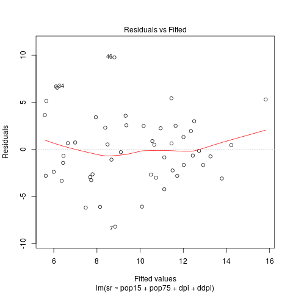
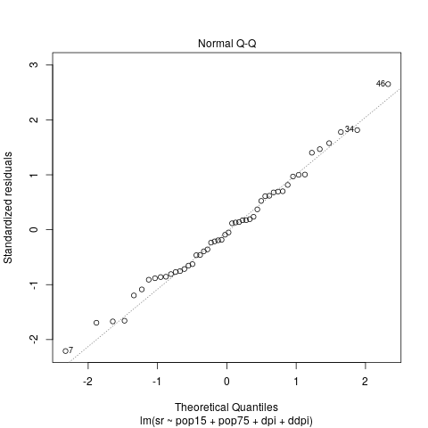
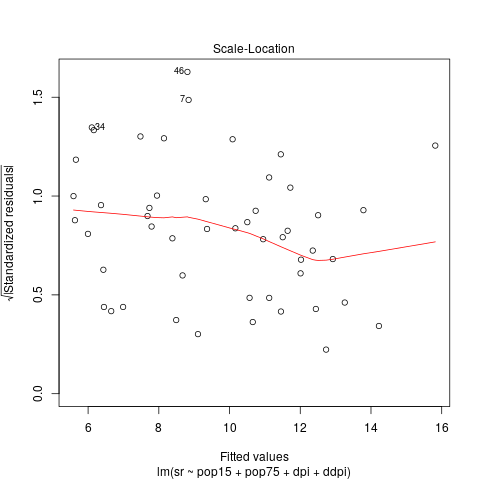
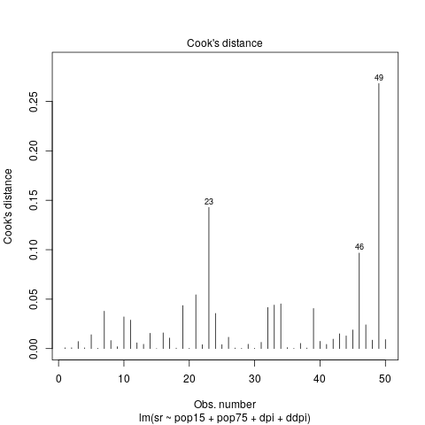
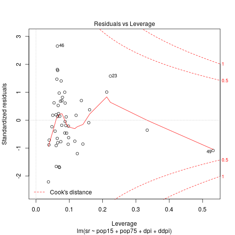
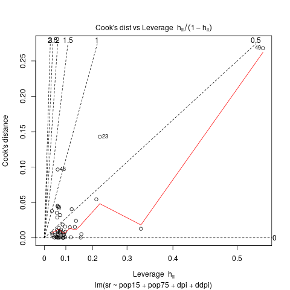

.. |r-model2-drawResidualsVsFitted| image:: imgR/plot21.png
    :scale: 70%
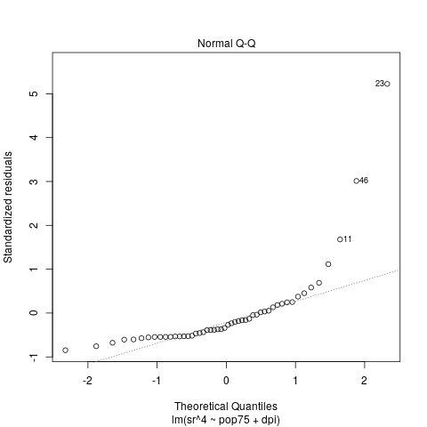
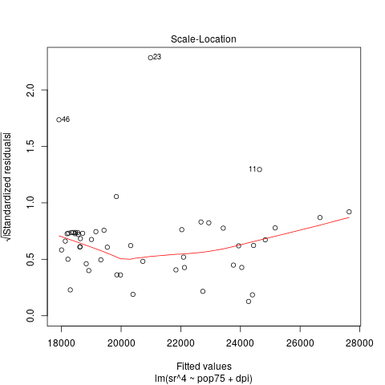
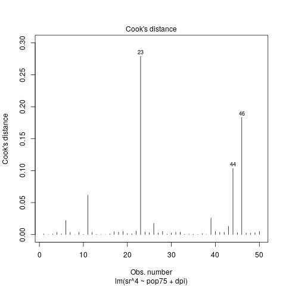
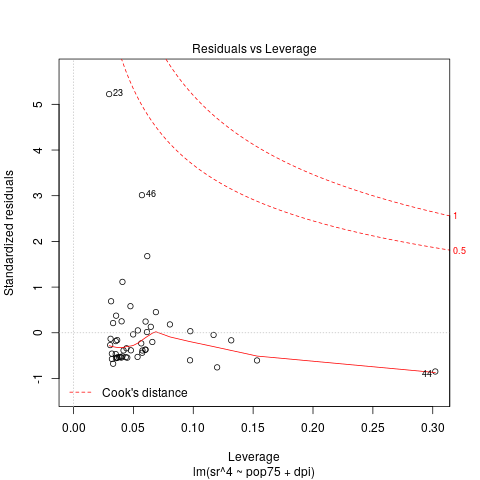
.. |r-model2-drawCookVsLeverages| image:: imgR/plot26.png
    :scale: 70%

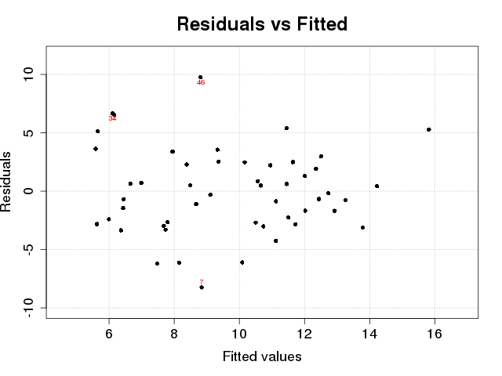
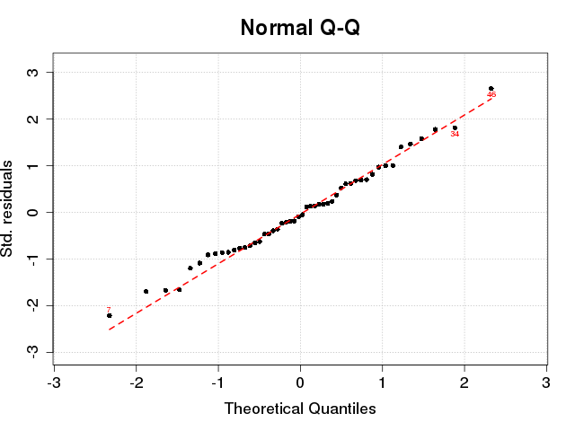
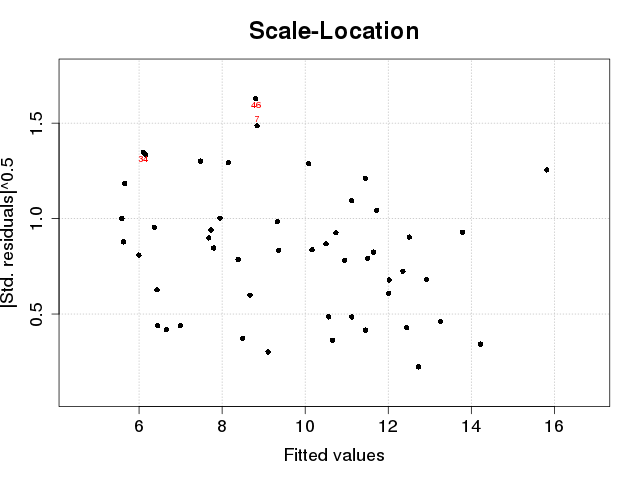
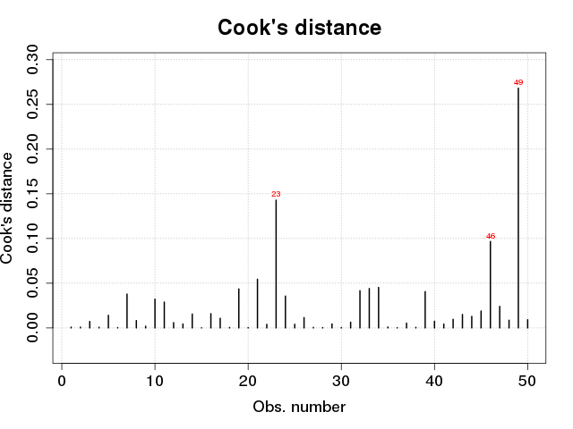
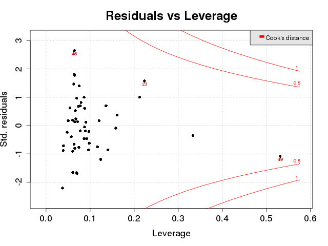
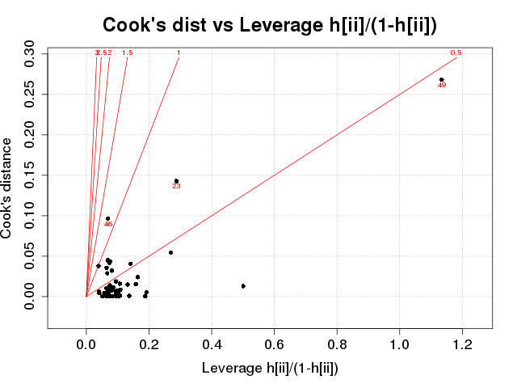

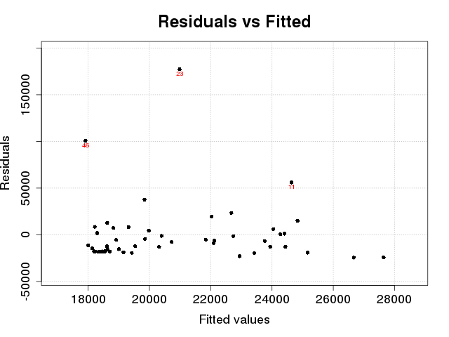
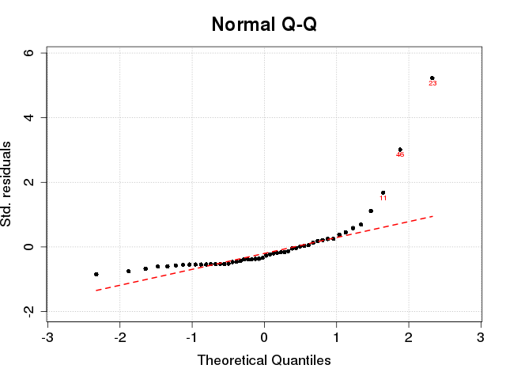
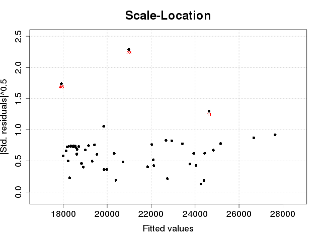
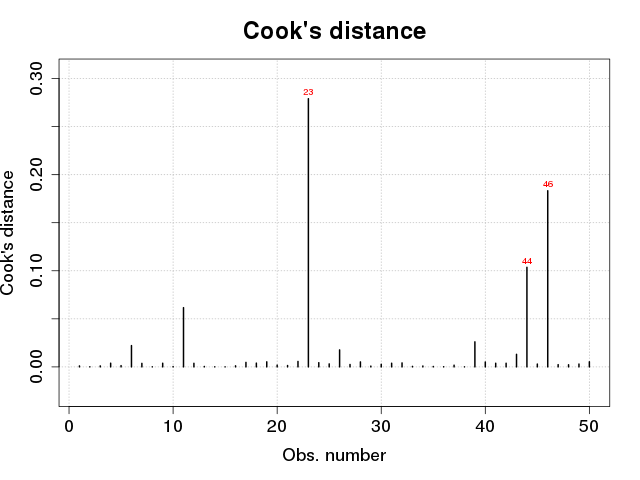
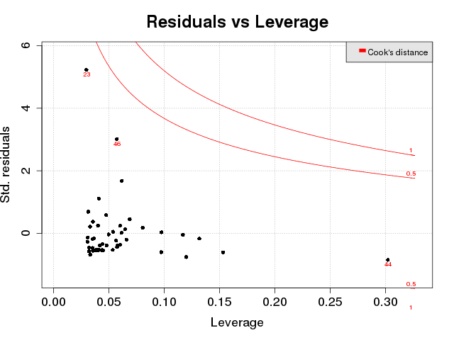
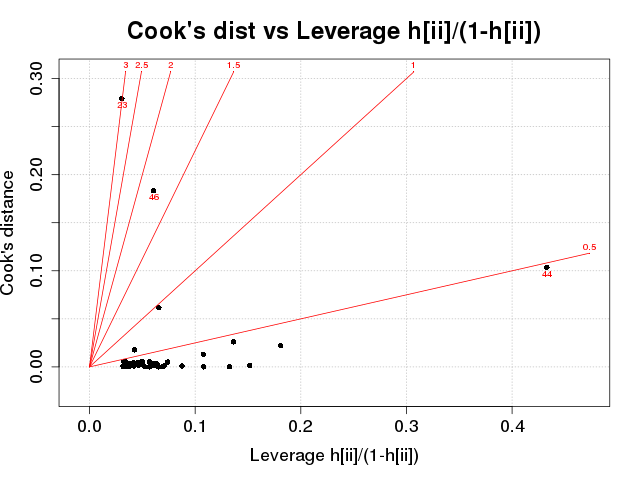

+--------------------------------------+---------------------------------------+--------------------------------------+-------------------------------------+
|  Model 1 - R                         |  Model 1 - OT                         |  Model 2 - R                         |  Model 2 - OT                       | 
+======================================+=======================================+======================================+=====================================+
| |r-model1-drawCookDistance|          | |ot-model1-drawCookDistance|          | |r-model2-drawCookDistance|          | |ot-model2-drawCookDistance|        |
| |r-model1-drawCookVsLeverages|       | |ot-model1-drawCookVsLeverages|       | |r-model2-drawCookVsLeverages|       | |ot-model2-drawCookVsLeverages|     |
| |r-model1-drawQQplot|                | |ot-model1-drawQQplot|                | |r-model2-drawQQplot|                | |ot-model2-drawQQplot|              |
| |r-model1-drawResidualsVsFitted|     | |ot-model1-drawResidualsVsFitted|     | |r-model2-drawResidualsVsFitted|     | |ot-model2-drawResidualsVsFitted|   |
| |r-model1-drawResidualsVsLeverages|  | |ot-model1-drawResidualsVsLeverages|  | |r-model2-drawResidualsVsLeverages|  | |ot-model2-drawResidualsVsLeverages||
| |r-model1-drawCookDistance|          | |ot-model1-drawCookDistance|          | |r-model2-drawCookDistance|          | |ot-model2-drawCookDistance|        |
+--------------------------------------+---------------------------------------+--------------------------------------+-------------------------------------+

